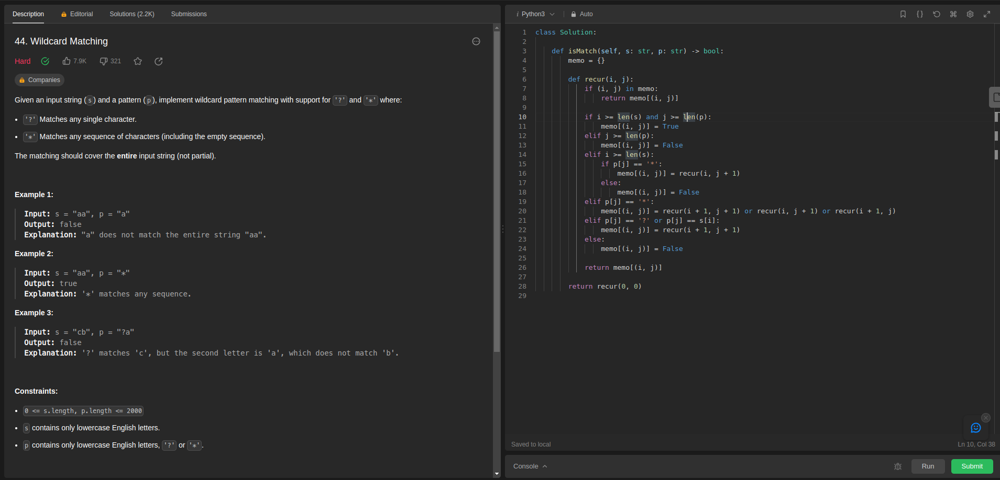
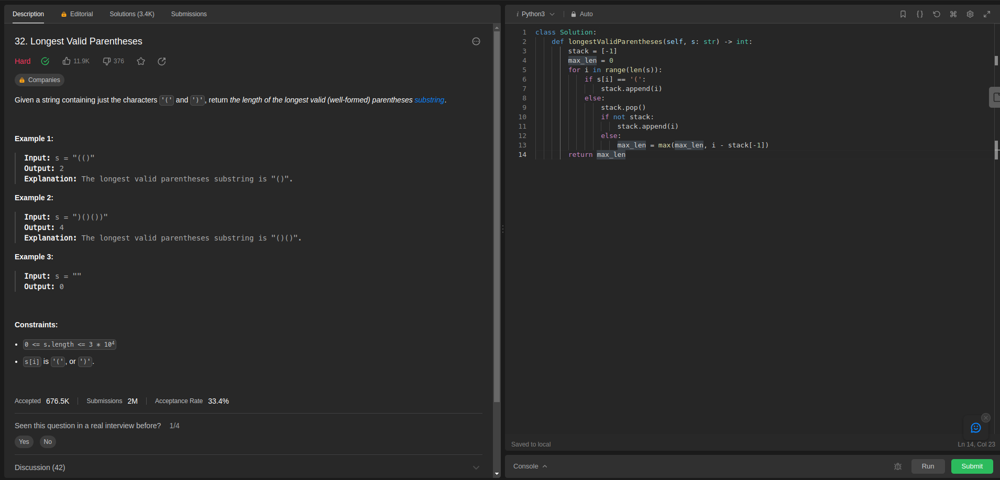
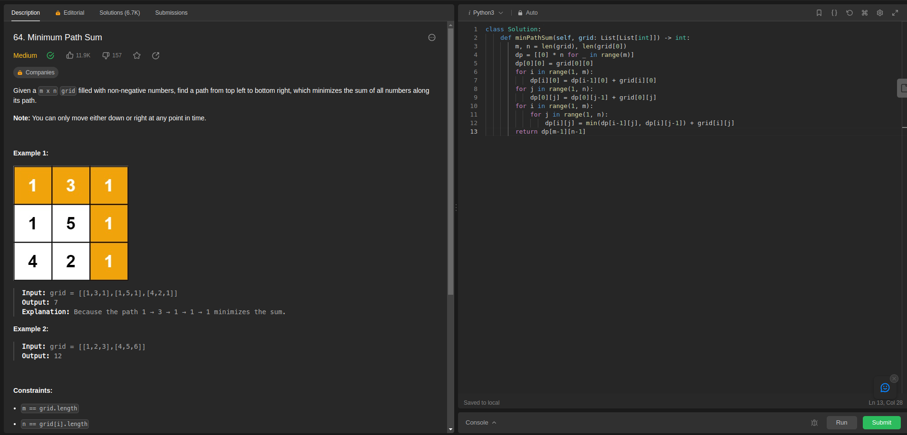

# Programação Dinâmica no LeetCode

**Número da Lista**: 5 
**Conteúdo da Disciplina**: Programação Dinâmica 

## Alunos
|Matrícula | Aluno |
| -- | -- |
| 21/1029559 | Rafael Brito Bosi Rodrigues |

## Sobre 

Este repositório tem como objetivo compilar a resolução de alguns problemas encontrados na plataforma [LeetCode](https://leetcode.com/), tais problemas estão dentro do escopo do conteúde abrangido por PD (Algoritmos de Programação Dinâmica).

| Exercício Solucionado | Dificuldade do Exercício |
| :-------------------: | :----------------------: |
| [44 - Wildcard Matching](https://leetcode.com/problems/wildcard-matching/description/)  | **Difícil** |
| [32 - Longest Valid Parentheses](https://leetcode.com/problems/longest-valid-parentheses/description/)  | **Difícil** |
| [64 - Minimum Path Sum](https://leetcode.com/problems/minimum-path-sum/description/)  | **Média** |

## Screenshots

Seguem aqui os screenshots das questões solucionadas, o print serve apenas para mostrar o indicador que demonstra que o problema foi resolvido com sucesso.

Importante ressaltar que todos os exercícios usam o princípio dos algoritmos de "Programação Dinâmica", 

### 44 - Wildcard Matching

Na imagem abaixo é possível observar no canto superior esquerdo a dificuldade atribuida a questão e o ícone de "check" que demonstra que o problema foi corretamente solucionado.

### 32 - Longest Valid Parentheses

Na imagem abaixo é possível observar no canto superior esquerdo a dificuldade atribuida a questão e o ícone de "check" que demonstra que o problema foi corretamente solucionado.

### 64 - Minimum Path Sum

Na imagem abaixo é possível observar no canto superior esquerdo a dificuldade atribuida a questão e o ícone de "check" que demonstra que o problema foi corretamente solucionado.

## Instalação 

**Linguagem**: Python 3 

Como o LeetCode é uma plataforma online que roda na web, não é necessário baixar nenhum tipo de dependência.

## Uso 

Para testar as soluções aqui propostas basta ir até o arquivo de ["exercicios"](./exercicios/), copiar o código da questão desejada, navegar até o link da questão que pretende testar e submeter o código ao juiz online.

Importante ressaltar que é necessário selecionar a linguagem "Python3" na plataforma, caso contrário, o código não irá funcionar.

## Outros 

Para acessar o vídeo onde os códigos e algoritmos são explicados e detalhados, basta clicar [aqui]().

